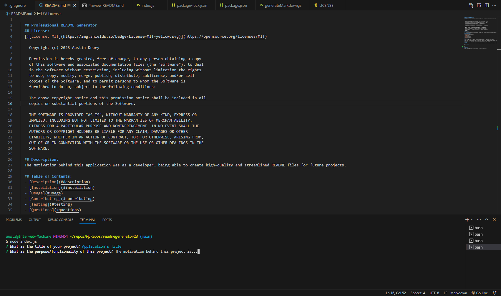
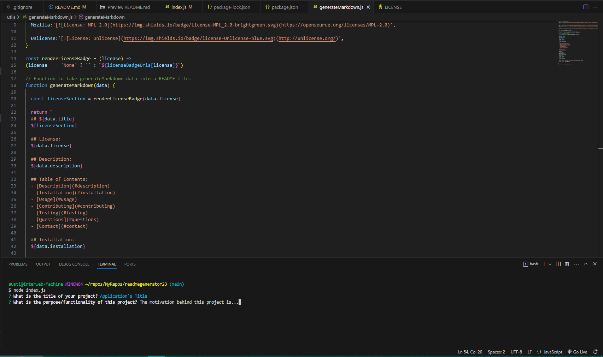

  ## Professional README Generator
  ## License:
  

  ## Description:
  The motivation behind this application was: as a developer, being able to create high-quality and streamlined README files for future projects.

  ## Table of Contents:
  - [Description](#description)
  - [Installation](#installation)
  - [Usage](#usage)
  - [Contributing](#contributing)
  - [Testing](#testing)
  - [Questions](#questions)
  - [Contact](#contact)
  - [Demo](#demo)

  ## Installation:
  * Step One: 'git clone' the repo into your local system so you have the Node project on your computer. 
  * Step Two: Run 'npm install' in order to install the  npm package dependencies as specified in the 'package.json'. 
  * Step Three: The application will begin by running 'node index.js' in the command line of the integrated terminal. Answer the prompts in your command line to generate a README. After answering all of the prompts, your README will be ready for you at the root of the repo.

  ## Usage:
  You use this application by answering the prompts given in the terminal, and at the end of the prompts, a README file is generated to be used, located in your root folder!
  
  

  ## Contributing:
  N/A

  ## Testing:
  N/A

  ## Questions:
  If you have any questions, feel free to contact me at austindrury@live.com.
  GitHub Profile: https://github.com/ausdru

  ## Demo:
  Feel free to watch the demonstration video below!
  https://drive.google.com/file/d/1UBxxy03I1ogHNeTbYvZ3r2mGfgAbNbIB/view?pli=1
